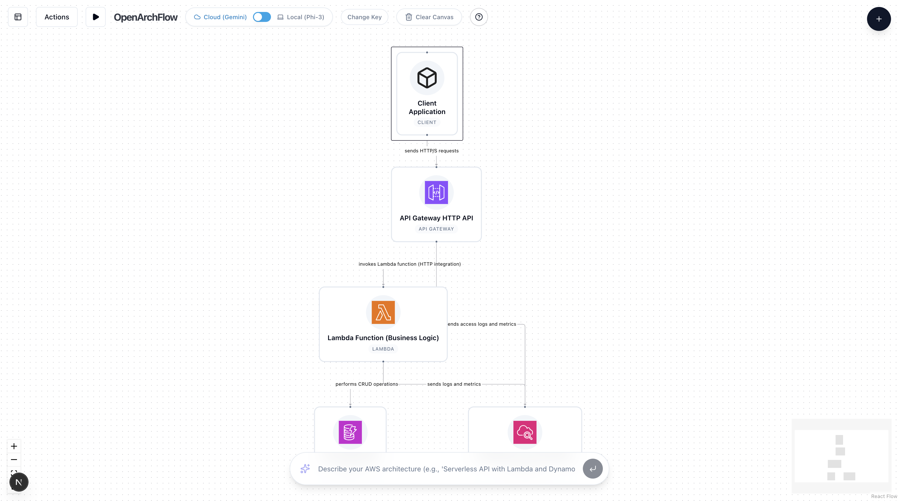

# OpenArchFlow 🏗️

<p align="center">
  
</p>

<p align="center">
  <strong>AI-Powered AWS Architecture Diagram Generator</strong>
  <br>
  Transform natural language into professional cloud architecture diagrams
</p>

<p align="center">
  <a href="#-features">Features</a> •
  <a href="#-getting-started">Getting Started</a> •
  <a href="#-tech-stack">Tech Stack</a> •
  <a href="#-contributing">Contributing</a> •
  <a href="#-license">License</a>
</p>

---

## 🌟 Overview

OpenArchFlow is an **open-source Progressive Web App** designed for cloud architects, DevOps engineers, and developers. Generate interactive AWS architecture diagrams from natural language descriptions using **AI, Large Language Models (LLMs), AI Agents, and AWS MCP (Model Context Protocol)**.

### Why OpenArchFlow?

- ✨ **Zero Setup**: No account required. Start designing immediately.
- 🔒 **Privacy First**: Runs entirely in your browser. Your data never leaves your device.
- 🎨 **AI-Powered**: Describe your architecture in plain English, get professional diagrams instantly.
- 🔧 **Fully Editable**: AI generates the initial design, you refine it with drag-and-drop.
- 📚 **AWS Standards**: Uses AWS Documentation MCP for up-to-date service recommendations.
- 🌐 **Offline Capable**: Local AI option (WebLLM) works without internet connection.

---

## ✨ Features

### 🤖 Dual AI Engine

- **Cloud AI (Gemini)**: Fast generation with Google's Gemini 2.5 Flash
- **Local AI (WebLLM)**: Privacy-focused, runs Phi-3 entirely in your browser via WebGPU

### 📐 Professional Diagram Capabilities

- **Auto-Layout**: One-click hierarchical organization using dagre algorithm
- **AWS Components**: 30+ AWS service components with official icons
- **Smart Connections**: Automatic edge routing and labels
- **Export Options**: Download diagrams as high-quality PNG images
- **Multi-Diagram Support**: Create and manage multiple architecture diagrams

### 📝 AI-Generated Documentation

- **Technical Specifications**: Generate comprehensive Markdown documentation
- **Architecture Overviews**: Executive summaries and component descriptions
- **Best Practices**: Security, scalability, and cost optimization recommendations
- **Preview & Copy**: View rendered Markdown or copy raw content

### 🎯 User Experience

- **Local-First**: All data stored in browser's localStorage/IndexedDB
- **No Backend Required**: 100% client-side application
- **Responsive Design**: Works on desktop and tablet devices
- **Dark Mode Support**: Beautiful UI with glassmorphism effects

---

## 🚀 Getting Started

### Prerequisites

- **Node.js** v25+ (recommended)
- **pnpm** package manager

### Installation

1. **Clone the repository:**

   ```bash
   git clone https://github.com/dmux/OpenArchFlow.git
   cd OpenArchFlow
   ```

2. **Install dependencies:**

   ```bash
   pnpm install
   ```

3. **Set up environment variables (optional for Cloud AI):**

   Create a `.env.local` file:

   ```bash
   cp .env.example .env.local
   ```

   Add your Gemini API key (only needed for Cloud AI):

   ```env
   GEMINI_API_KEY=your_gemini_api_key_here
   UPSTASH_REDIS_REST_URL=your_upstash_url (optional, for rate limiting)
   UPSTASH_REDIS_REST_TOKEN=your_upstash_token (optional)
   ```

   > **Note**: You can use Local AI (WebLLM) without any API keys!

4. **Run the development server:**

   ```bash
   pnpm dev
   ```

   Open [http://localhost:3000](http://localhost:3000) to start creating diagrams!

### Build for Production

```bash
pnpm build
pnpm start
```

---

## 🛠️ Tech Stack

| Category | Technologies |
|----------|-------------|
| **Framework** | Next.js 16+ (App Router) |
| **Language** | TypeScript |
| **Styling** | Tailwind CSS + shadcn/ui |
| **Diagramming** | React Flow + dagre (Auto-layout) |
| **State Management** | Zustand |
| **AI - Cloud** | Google Gemini 2.5 Flash |
| **AI - Local** | WebLLM (Phi-3-mini via WebGPU) |
| **Documentation** | react-markdown + remark-gfm |
| **Export** | html2canvas |
| **Icons** | Lucide React |

---

## 📖 How to Use

### 1. Generate Diagram with AI

1. Choose between **Cloud AI** (Gemini) or **Local AI** (Phi-3)
2. Type your architecture description:
   ```
   Serverless API with Lambda, API Gateway, DynamoDB, and S3
   ```
3. Press Enter and watch your diagram appear!

### 2. Organize Layout

- Click **Actions** → **Auto Layout** to automatically arrange components
- Drag and drop nodes to customize positions
- Connect components by dragging edges

### 3. Generate Documentation

- Click **Actions** → **Generate Specification**
- View rendered Markdown or raw code
- Copy to clipboard for your wiki/documentation

### 4. Export Diagram

- Click **Actions** → **Export as PNG**
- Download professional diagrams for presentations

---

## 🤝 Contributing

We welcome contributions from the community! OpenArchFlow is built **by architects and engineers for architects and engineers**.

### How to Contribute

1. **Fork the repository**
2. **Create a feature branch**: `git checkout -b feature/amazing-feature`
3. **Commit your changes**: `git commit -m 'Add amazing feature'`
4. **Push to the branch**: `git push origin feature/amazing-feature`
5. **Open a Pull Request**

### Development Guidelines

- Write clear, descriptive commit messages
- Follow the existing code style (TypeScript + ESLint)
- Test your changes thoroughly
- Update documentation as needed

### Ideas for Contributions

- 🆕 Add more AWS services (AppSync, EKS, ECS, etc.)
- 🎨 Improve UI/UX design
- 🌍 Add internationalization (i18n)
- 📱 Mobile device support
- 🧪 Add unit and integration tests
- 📚 Improve AI prompts for better diagrams

---

## 🔐 Privacy & Security

**Your privacy is our priority:**

- ✅ **No data collection**: We don't collect any personal data, diagrams, or API keys
- ✅ **Local storage only**: All your work stays on your device
- ✅ **No tracking**: No analytics, no cookies, no telemetry
- ✅ **Open source**: The entire codebase is available for inspection
- ✅ **Optional cloud AI**: Use Local AI for complete offline privacy

---

## 📄 License

This project is open source and available under the [MIT License](LICENSE).

---

## 👨‍💻 Author

**Rafael Sales**  
📧 rafael.sales@gmail.com  
🐙 [GitHub](https://github.com/dmux/OpenArchFlow)

---

## ⭐ Show Your Support

If you find OpenArchFlow useful, please consider:

- ⭐ Starring the repository
- 🐛 Reporting bugs or suggesting features via [Issues](https://github.com/dmux/OpenArchFlow/issues)
- 🤝 Contributing to the project
- 📢 Sharing with your network

---

## 🙏 Acknowledgments

Built with ❤️ by the developer and architect community, for the community.

Special thanks to:
- AWS for comprehensive documentation and service icons
- Google Gemini for powerful AI capabilities
- WebLLM team for enabling local AI inference
- The open-source community for amazing tools and libraries

---

<p align="center">
  Made with ☕ and 💻 for Cloud Architects
</p>
