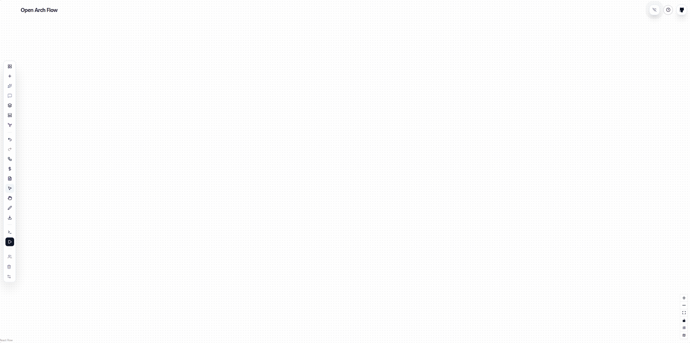

# OpenArchFlow 🏗️

<p align="center">
  
</p>

<p align="center">
  <strong>AI-Powered AWS Architecture Diagram Generator</strong>
  <br>
  Transform natural language into professional cloud architecture diagrams
</p>

<p align="center">
  <a href="#-features">Features</a> •
  <a href="#-getting-started">Getting Started</a> •
  <a href="#-tech-stack">Tech Stack</a> •
  <a href="#-contributing">Contributing</a> •
  <a href="#-license">License</a>
</p>

<p align="center">
  
  
  
  
</p>

---

## 🌟 Overview

OpenArchFlow is an **open-source Progressive Web App** designed for cloud architects, DevOps engineers, and developers. Go from natural language description to a running local AWS environment in seconds — generate interactive architecture diagrams with AI, export production-ready Terraform, and **deploy directly to a local AWS emulator** for immediate hands-on testing, all without an AWS account.

### Why OpenArchFlow?

- ✨ **Zero Setup**: No account required. Start designing immediately.
- 🔒 **Privacy First**: Runs entirely in your browser. Your data never leaves your device.
- 🎨 **AI-Powered**: Describe your architecture in plain English, get professional diagrams instantly.
- 💰 **Cost Estimation**: Integrated AWS Pricing API to calculate real-world architecture costs.
- 🔧 **Fully Editable**: AI generates the initial design, you refine it with drag-and-drop.
- 📚 **AWS Standards**: Uses AWS Documentation MCP for up-to-date service recommendations.
- 🌐 **Offline Capable**: Local AI option (WebLLM) works without internet connection.
- 🚀 **Local Deploy**: Deploy your diagram to a local AWS emulator (MiniStack) with one click — no cloud account needed.
- ☁️ **Cloud Backup**: Sign in with Google to sync all your diagrams to Google Drive automatically.

---

## ✨ Features

### 🤝 Real-time P2P Collaboration (NEW)

- **Peer-to-Peer Architecture**: Design together in real-time with direct browser-to-browser synchronization.
- **End-to-End Encryption (E2EE)**: All data is encrypted with a key stored in the URL fragment (`#hash`), which is never sent to the signaling server (Zero-Knowledge).
- **No Central Storage**: Your diagrams are never stored on any central server. Synchronization happens directly between peers via WebRTC.
- **Live Presence**: See how many peers are connected to your session directly in the toolbar.

### ☁️ Google Account & Drive Sync (NEW)

- **One-click sign-in** — A single Google OAuth popup grants both identity and Drive access. Your profile photo appears in the toolbar as a status button.
- **Auto-sync** — Every diagram change is automatically backed up to your personal Google Drive (debounced 3 s). Only files created by this app are ever accessed (`drive.file` scope).
- **Conflict resolution** — If the cloud copy is newer on app load, you can choose "Use Cloud" or "Keep Local" — no silent overwrites.
- **Unified status** — The account button shows a Drive-status dot (green / syncing / error) and a popover with last-sync time, Sync Now, and Sign out actions.

### 🤖 Dual AI Engine

- **Cloud AI (Gemini)**: Choose between **Gemini 2.0 Flash** (fastest), **Gemini 2.5 Flash** (balanced, default), or **Gemini 2.5 Pro** (most capable) — selectable directly from the AI Provider dialog.
- **Local AI (WebLLM)**: Privacy-focused, runs Phi-3 entirely in your browser via WebGPU
- **Incremental Generation**: AI can intelligently modify and append to existing architecture diagrams instead of starting from scratch
- **Diagram Chat**: Discuss your architecture with an AI Assistant directly from the toolbar for explanations, pricing estimates, and security reviews

### 💰 AWS Pricing & Cost Estimation

- **Real-time Pricing**: Fetches live data from the AWS Price List API for EC2, RDS, S3, Lambda, and more
- **Usage Configuration**: Customize regions, instance types, and usage quantities (storage GBs, requests) for precise estimates
- **Bill of Materials (BOM)**: View a consolidated cost breakdown for your entire architecture in a dedicated panel
- **Export to CSV**: Download your cost estimate for architectural proposals or budgeting

### 🚀 MiniStack Local Deploy (NEW)

Deploy your architecture diagram to a local AWS emulator ([MiniStack](https://ministack.dev)) running on `localhost:4566` — turning OpenArchFlow into a full **design → deploy → operate** platform with no cloud costs and no AWS account required.

**Getting started:**

```bash
docker run -p 4566:4566 ministackorg/ministack
```

Then click the **Rocket** icon in the toolbar, configure the endpoint, and hit **Deploy All**.

**Supported AWS services:**

| Service | What gets created | Interactive Console |
|---|---|---|
| **S3** | S3 bucket | List, upload, delete objects |
| **Lambda** | Function (stub handler) | Invoke, edit config, upload `.zip`, live logs |
| **DynamoDB** | Table (`id` hash key) | Scan items, put item |
| **SQS** | Queue | Send/receive/delete messages |
| **SNS** | Topic | Publish, subscribe |
| **EventBridge** | Event bus | View rules, put events |
| **Kinesis** | Stream (1 shard) | — |
| **API Gateway** | REST API + routes + stage | Add routes, test endpoints |
| **IAM** | Role | — |
| **KMS** | Key | — |
| **Secrets Manager** | Secret | — |
| **SSM Parameter Store** | Parameter | — |
| **CloudWatch Logs** | Read-only | Browse groups/streams, live polling |

**Key capabilities:**

- **One-click Deploy All** from the MiniStack panel — per-node status badges update in real time.
- **Per-node console** — click any deployed node to open its interactive console (S3 browser, Lambda invoker, SQS message reader, etc.).
- **Simulation hybrid mode** — when a node is deployed, simulation traffic is routed to the real MiniStack resource and uses wall-clock latency instead of synthetic values.
- **Traffic Source node** — generate configurable req/s traffic from the diagram canvas; live response icon shows last result.
- **Browser-direct** — all AWS SDK v3 calls go from your browser directly to `localhost:4566`. Works even when OpenArchFlow is hosted on Vercel.
- **Teardown** — delete all deployed resources in one action.

### 🏗️ Terraform IaC Generation (NEW)

- **HCL Code Generation**: Export your AWS architecture diagram directly as production-ready HashiCorp Terraform — `main.tf`, `variables.tf`, and `outputs.tf` generated from your nodes and edges.
- **60+ AWS Resource Mappings**: EC2, Lambda, RDS, DynamoDB, S3, VPC, ALB, API Gateway, CloudFront, EKS, ECS, SQS, SNS, ElastiCache, and more — with dependency inference from diagram edges (`depends_on`).
- **AI-Enhanced Generation**: Combines Gemini 2.5 Flash with the HashiCorp Terraform MCP server to produce schema-accurate HCL with IAM roles and security groups.
- **Monaco HCL Editor**: Full HCL syntax highlighting, bracket matching, and snippet completions. Switch between dark/light/auto themes from the editor toolbar.
- **Per-Node IaC Config**: Override resource type and name directly from the Properties Panel for any AWS node.
- **Cloud-Agnostic Architecture**: Pluggable `IaCGenerator` interface designed to support CDK, Pulumi, or CloudFormation in the future.

### 🎮 Diagram Simulation & Interactivity

- **Architecture Simulation**: Playback and simulate data flows and traffic patterns to visualize how your architecture behaves
- **Presentation Tools**: Built-in Laser Pointer mode for presenting architectures to your team

### 📐 Professional Diagram Capabilities

- **Auto-Layout**: One-click hierarchical organization using dagre algorithm
- **Massive Component Library**: Hundreds of official components for AWS, Azure, Cloud Native, Observability (Datadog, Sentry), Integrations (Stripe, Twilio), and Generic shapes
- **AWS Architecture Groups**: Pre-styled containers for VPC, Subnet, Availability Zone, Region, On-Premises, and Security Zone — matching draw.io-level solution design capability
- **Smart Connections**: Automatic edge routing and labels
- **Export Options**: Download diagrams as high-quality PNG images or JSON files
- **Multi-Diagram Support**: Create, manage, and backup multiple architecture diagrams
- **Import/Export**: detailed JSON export for individual diagrams or full backup of all work
- **Versioning**: Backward-compatible file format ensures your data is safe across updates

### 📝 AI-Generated Documentation

- **Technical Specifications**: Generate comprehensive Markdown documentation
- **Architecture Overviews**: Executive summaries and component descriptions
- **Best Practices**: Security, scalability, and cost optimization recommendations
- **Preview & Copy**: View rendered Markdown or copy raw content

### 🎯 User Experience

- **Local-First**: All data stored in browser's localStorage/IndexedDB
- **No Backend Required**: 100% client-side application
- **Responsive Design**: Works on desktop and tablet devices
- **Dark Mode Support**: Beautiful UI with glassmorphism effects

---

## 🚀 Getting Started

### Prerequisites

- **Node.js** v25+ (recommended)
- **pnpm** package manager

### Installation

1. **Clone the repository:**

   ```bash
   git clone https://github.com/dmux/OpenArchFlow.git
   cd OpenArchFlow
   ```

2. **Install dependencies:**

   ```bash
   pnpm install
   ```

3. **Set up environment variables (optional for Cloud AI):**

   Create a `.env.local` file:

   ```bash
   cp .env.example .env.local
   ```

   Add your Gemini API key (only needed for Cloud AI):

   ```env
   GEMINI_API_KEY=your_gemini_api_key_here
   UPSTASH_REDIS_REST_URL=your_upstash_url (optional, for rate limiting)
   UPSTASH_REDIS_REST_TOKEN=your_upstash_token (optional)
   ```

   > **Note**: You can use Local AI (WebLLM) without any API keys!

4. **Run the development server:**

   ```bash
   pnpm dev
   ```

   Open [http://localhost:3000](http://localhost:3000) to start creating diagrams!

### Build for Production

```bash
pnpm build
pnpm start
```

---

## 🛠️ Tech Stack

| Category              | Technologies                     |
| --------------------- | -------------------------------- |
| **Framework**         | Next.js 16+ (App Router)         |
| **Language**          | TypeScript                       |
| **Styling**           | Tailwind CSS + shadcn/ui         |
| **Diagramming**       | React Flow + dagre (Auto-layout) |
| **State Management**  | Zustand                          |
| **AI - Cloud**        | Google Gemini 2.0/2.5 Flash · 2.5 Pro |
| **AI - Local**        | WebLLM (Phi-3-mini via WebGPU)   |
| **P2P Collaboration** | Yjs + WebRTC                     |
| **Documentation**     | react-markdown + remark-gfm      |
| **Local Deploy**      | MiniStack + AWS SDK v3 (browser) |
| **IaC Editor**        | Monaco Editor + HCL              |
| **Export**            | html2canvas                      |
| **Icons**             | Lucide React                     |

---

## 📖 How to Use

### 1. Generate Diagram with AI

1. Choose between **Cloud AI** (Gemini) or **Local AI** (Phi-3)
2. Type your architecture description:
   ```
   Serverless API with Lambda, API Gateway, DynamoDB, and S3
   ```
3. Press Enter and watch your diagram appear!

### 2. Organize Layout

- Click **Actions** → **Auto Layout** to automatically arrange components
- Drag and drop nodes to customize positions
- Connect components by dragging edges

### 3. Generate Documentation

- Click **Actions** → **Generate Specification**
- View rendered Markdown or raw code
- Copy to clipboard for your wiki/documentation

### 4. Sign in with Google (optional)

1. Click the **cloud/account icon** in the toolbar
2. Complete the Google sign-in popup — grants identity and Drive access in one step
3. Your profile photo replaces the icon; diagrams auto-sync to Drive from this point on

### 5. Collaborate in Real-time

1. Click the **Users** icon in the toolbar
2. Click **Start Collaborating**
3. Share the generated link (E2EE) with your team
4. Watch updates happen instantly across all screens!

### 6. Deploy to Local AWS (MiniStack)

1. Start MiniStack: `docker run -p 4566:4566 ministackorg/ministack`
2. Click the **🚀 Rocket** icon in the toolbar
3. Click **Test Connection** — you should see "Connected"
4. Click **Deploy All** — nodes deploy in sequence with live status badges
5. Click any deployed node → **Open Console** to interact with the resource
6. Run a simulation — deployed nodes receive real traffic from the simulation engine

### 7. Export Diagram

- Click **Actions** → **Export as PNG**
- Download professional diagrams for presentations

### 8. Manage Diagrams (Import/Export)

- **Export Single**: Click the download icon (⬇️) next to a diagram in the sidebar to save it as a JSON file.
- **Backup All**: Click **Backup All** in the sidebar footer to export all your diagrams at once.
- **Import**: Click **Import** to restore diagrams from a JSON file.
  - Automatically handles versioning
  - Merges with existing diagrams safely (renames duplicates)

---

## 🔖 Versioning

OpenArchFlow follows [Semantic Versioning](https://semver.org/) (`MAJOR.MINOR.PATCH`):

| Segment   | When to bump                                                            | Example |
| --------- | ----------------------------------------------------------------------- | ------- |
| **MAJOR** | Breaking changes to file format or public API                           | `1.0.0` |
| **MINOR** | New features, new providers, new AI capabilities (backwards-compatible) | `0.3.0` |
| **PATCH** | Bug fixes, dependency updates, UI tweaks                                | `0.2.1` |

All notable changes are documented in **[CHANGELOG.md](CHANGELOG.md)**, following the [Keep a Changelog](https://keepachangelog.com/en/1.1.0/) format.

### How to Release a New Version

1. **Update `package.json`** — bump the `"version"` field
2. **Update `CHANGELOG.md`** — move items from `[Unreleased]` to a new dated section
3. **Commit** the release:
   ```bash
   git add package.json CHANGELOG.md
   git commit -m "chore: release vX.Y.Z"
   ```
4. **Tag** the release:
   ```bash
   git tag -a vX.Y.Z -m "Release vX.Y.Z"
   git push && git push --tags
   ```

> The version is automatically injected into the UI at build time via `NEXT_PUBLIC_APP_VERSION` — no manual UI updates needed.

---

## 🤝 Contributing

We welcome contributions from the community! OpenArchFlow is built **by architects and engineers for architects and engineers**.

### How to Contribute

1. **Fork the repository**
2. **Create a feature branch**: `git checkout -b feature/amazing-feature`
3. **Commit your changes**: `git commit -m 'Add amazing feature'`
4. **Push to the branch**: `git push origin feature/amazing-feature`
5. **Open a Pull Request**

### Development Guidelines

- Write clear, descriptive commit messages following [Conventional Commits](https://www.conventionalcommits.org/) (`feat:`, `fix:`, `chore:`, `docs:`)
- Follow the existing code style (TypeScript + ESLint)
- Test your changes thoroughly
- Update `CHANGELOG.md` under `[Unreleased]` for any user-visible changes
- Bump the version in `package.json` when submitting a release PR

### Ideas for Contributions

- 🆕 Add more AWS services (AppSync, EKS, ECS, etc.)
- 🎨 Improve UI/UX design
- 🌍 Add internationalization (i18n)
- 📱 Mobile device support
- 🧪 Add unit and integration tests
- 📚 Improve AI prompts for better diagrams

---

## 🔐 Privacy & Security

**Your privacy is our priority:**

- ✅ **No data collection**: We don't collect any personal data, diagrams, or API keys
- ✅ **Local storage only**: All your work stays on your device
- ✅ **No tracking**: No analytics, no cookies, no telemetry
- ✅ **Open source**: The entire codebase is available for inspection
- ✅ **Optional cloud AI**: Use Local AI for complete offline privacy

---

## 📄 License

This project is open source and available under the [MIT License](LICENSE).

---

## 👨‍💻 Author

**Rafael Sales**  
📧 rafael.sales@gmail.com  
🌐 [rfsales.dev](https://rfsales.dev)  
🐙 [GitHub](https://github.com/dmux/OpenArchFlow)

---

## ⭐ Show Your Support

If you find OpenArchFlow useful, please consider:

- ⭐ Starring the repository
- 🐛 Reporting bugs or suggesting features via [Issues](https://github.com/dmux/OpenArchFlow/issues)
- 🤝 Contributing to the project
- 📢 Sharing with your network

---

## 🙏 Acknowledgments

Built with ❤️ by the developer and architect community, for the community.

Special thanks to:

- AWS for comprehensive documentation and service icons
- Google Gemini for powerful AI capabilities
- WebLLM team for enabling local AI inference
- The open-source community for amazing tools and libraries

---

<p align="center">
  Made with ☕ and 💻 for Cloud Architects
</p>
